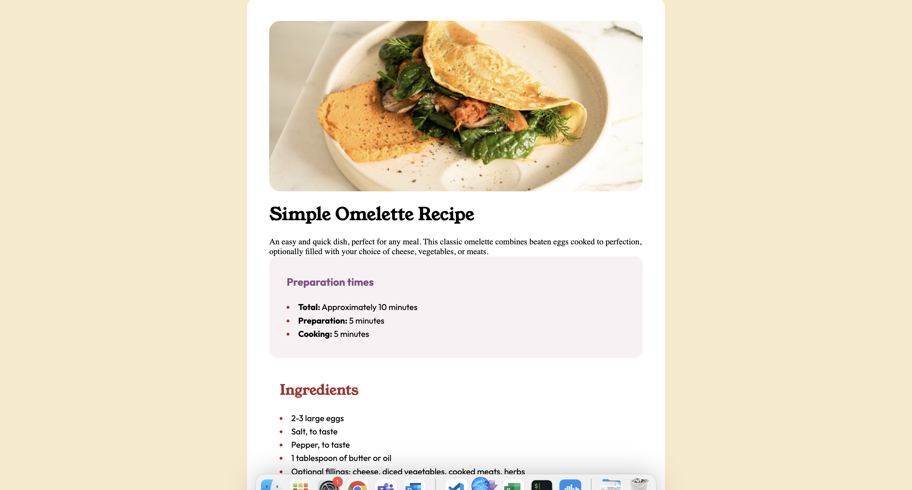

# Simple Omelette Recipe

An easy and quick dish perfect for any meal, this classic omelette features beaten eggs cooked to perfection and can be customized with your choice of cheese, vegetables, or meats.

## Preparation Times

- **Total:** Approximately 10 minutes
- **Preparation:** 5 minutes
- **Cooking:** 5 minutes

## Ingredients

- 2-3 large eggs
- Salt, to taste
- Pepper, to taste
- 1 tablespoon of butter or oil
- Optional fillings: cheese, diced vegetables, cooked meats, herbs

## Instructions

1. **Beat the Eggs:** In a bowl, beat the eggs with a pinch of salt and pepper until well mixed. For a fluffier texture, you can add a tablespoon of water or milk.

2. **Heat the Pan:** Place a non-stick frying pan over medium heat and add the butter or oil.

3. **Cook the Omelette:** Once the butter is melted and bubbling, pour in the eggs. Tilt the pan to ensure the eggs evenly coat the surface.

4. **Add Fillings (Optional):** When the eggs begin to set at the edges but are still slightly runny in the middle, sprinkle your chosen fillings over one half of the omelette.

5. **Fold and Serve:** As the omelette continues to cook, carefully lift one edge and fold it over the fillings. Let it cook for another minute, then slide it onto a plate.

6. **Enjoy:** Serve hot with additional salt and pepper if needed.

## Tips

- For extra flavor, consider adding herbs like chives or parsley.
- Experiment with different fillings to find your favorite combination.

# Sample images

